# Ex02-Outlier

You are given bhp.csv which contains property prices in the city of banglore, India. You need to examine price_per_sqft column and do following,

(1) Remove outliers using IQR 

(2) After removing outliers in step 1, you get a new dataframe.

(3) use zscore of 3 to remove outliers. This is quite similar to IQR and you will get exact same result

(4) for the data set height_weight.csv find the following

    (i) Using IQR detect weight outliers and print them

    (ii) Using IQR, detect height outliers and print them

## Aim:
TO detect and remove the outliers in the given data set and save the final data.

## Algorithm:
### Step 1:
Import the required packages(pandas,numpy,scipy)

### Step 2:
Read the given csv file

### Step3:
Convert the file into a dataframe and get information of the data.

### Step 4:
Remove the non numerical data columns using drop() method.

### Step 5:
Detect the outliers in the data set using z scores method.

### Step 6:
Remove the outliers by z scores and list manupilation or by using Interquartile Range(IQR)

### Step 7:
Check if the outliersare removed from data set using graphical methods.

### Step 8:
Save the final data set into the file.

## Program:
1) & (2) Examine price_per_sqft column and use IQR to remove outliers and create new dataframe.
```
import pandas as pd
import numpy as np
import seaborn as sns
df = pd.read_csv("/content/bhp.csv")
df
df.head()
df.describe()
df.info()
df.isnull().sum()
df.shape
sns.boxplot(x="price_per_sqft",data=df)
q1 = df['price_per_sqft'].quantile(0.25)
q3 = df['price_per_sqft'].quantile(0.75)
print("First Quantile =",q1,"\nSecond Quantile =",q3)
IQR = q3-q1
ul = q3+1.5*IQR
ll = q1-1.5*IQR
df1 =df[((df['price_per_sqft']>=ll)&(df['price_per_sqft']<=ul))]
df1
df1.shape
sns.boxplot(x="price_per_sqft",data=df1)
```
(3)Examine price_per_sqft column and use zscore of 3 to remove outliers.
```
from scipy import stats
z = np.abs(stats.zscore(df['price_per_sqft']))
df2 = df[(z<3)]
df2
print(df2.shape)
sns.boxplot(x="price_per_sqft",data=df2)
```
(4)(i) For the data set height_weight.csv detect weight outliers using IQR method.
```
import pandas as pd
import numpy as np
import seaborn as sns
df = pd.read_csv("/content/height_weight - Sheet1.csv")
df
df.head()
df.info()
df.describe()
df.isnull().sum()
df.shape
print("First Quantile =",q1,"\nSecond Quantile =",q3)
IQR = q3-q1
ul = q3+1.5*IQR
ll = q1-1.5*IQR
df1 =df[((df['weight']>=ll)&(df['weight']<=ul))]
df1
df1.shape
sns.boxplot(x="weight",data=df1)
```
(4)(ii) For the data set height_weight.csv detect height outliers using IQR method.
```
sns.boxplot(x="height",data=df)
q1 = df['height'].quantile(0.25)
q3 = df['height'].quantile(0.75)
print("First Quantile =",q1,"\nSecond Quantile =",q3)
IQR = q3-q1
ul = q3+1.5*IQR
ll = q1-1.5*IQR
df2 =df[((df['height']>=ll)&(df['height']<=ul))]
df2
df2.shape
sns.boxplot(x="height",data=df2)
```
OUTPUT:
(1)(2) Examine price_per_sqft column and use IQR to remove outliers and create new dataframe.

Dataset:
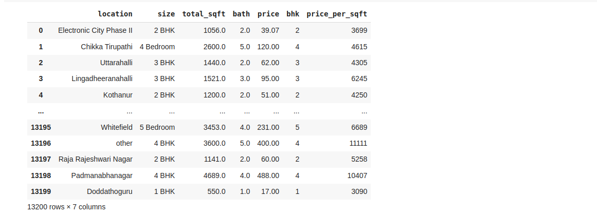

Dataset Head :
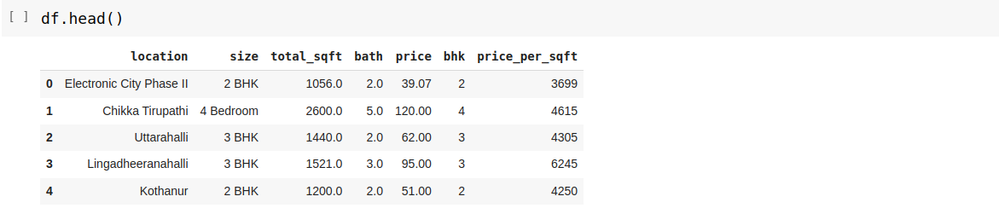


Dataset Info :
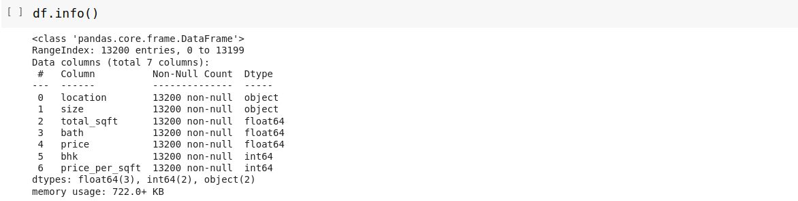


Dataset Describe:


Null Values:
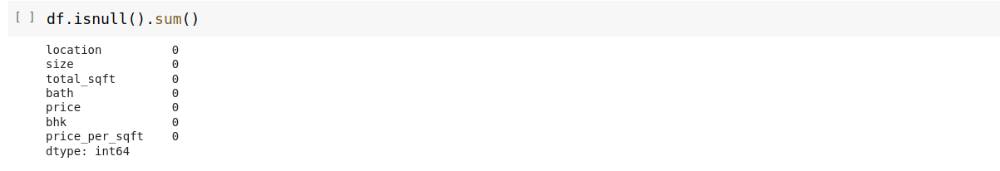


Dataset Shape:

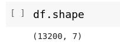


Box plot of price_per_sqft column with outliers:
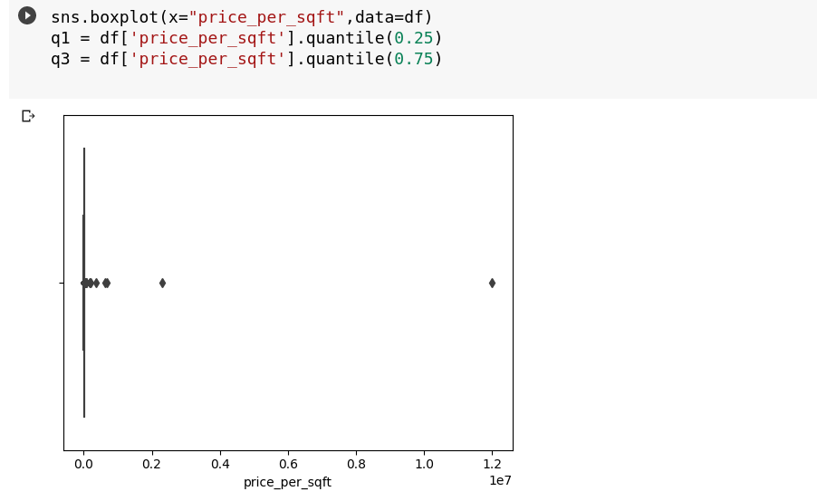


price_per_sqft - Dataset after removing outliers:
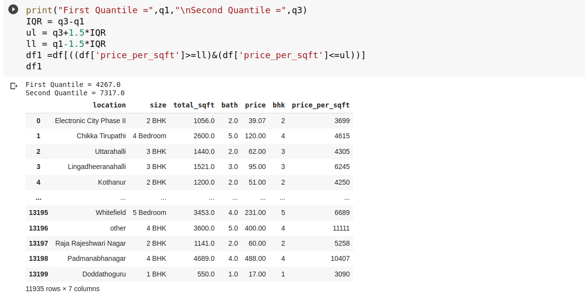


price_per_sqft - Shape of Dataset after removing outliers :
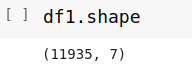


Box Plot of price_per_sqft column without outliers:


Examine price_per_sqft column and use zscore of 3 to remove outliers.
Dataset after removal of outlier using z score:
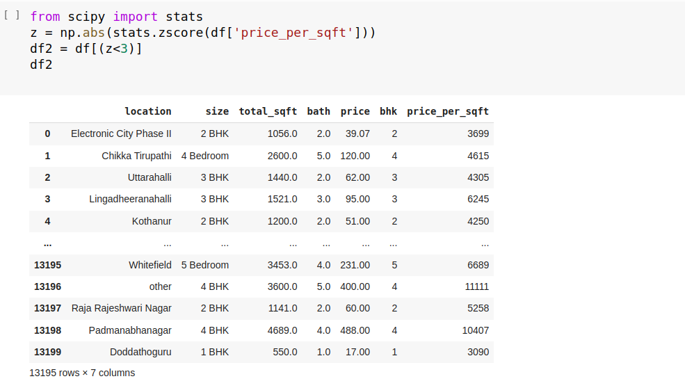


Shape of Dataset after removal of outlier using z score:
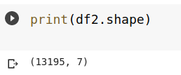


(4) For the data set height_weight.csv detect weight and height outliers using IQR method:
Dataset:
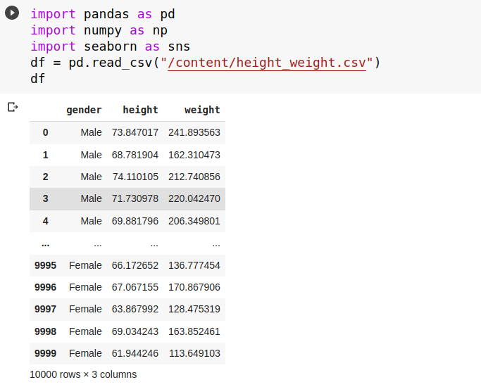


Dataset Head:
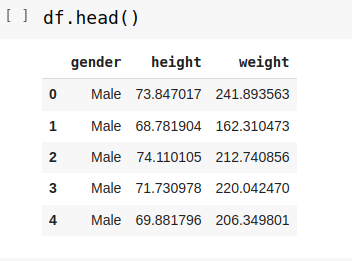


Dataset Info:
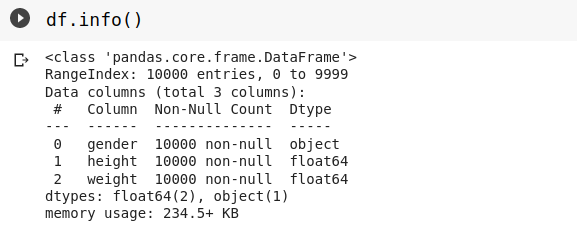


Dataset Describe:


Null Values:
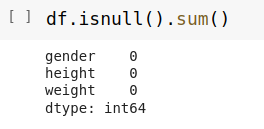


Dataset Shape:
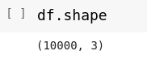


Weight - With outliers:
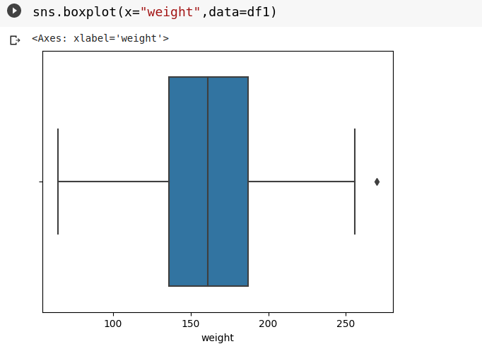


Weight - Dataset after removing Outliers using IQR method:
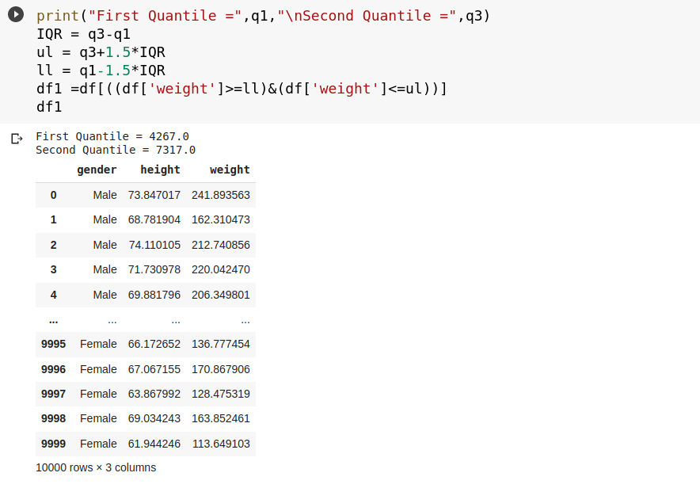


Weight - Shape of Dataset after removing Outliers using IQR method:
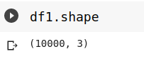


Weight - Without Outliers using IQR method:


Height - With outliers:
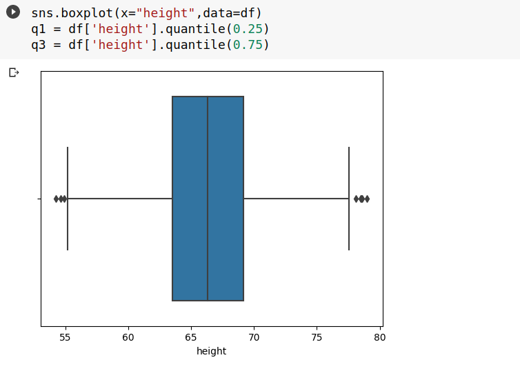


Height - Dataset after removing Outliers using IQR method:
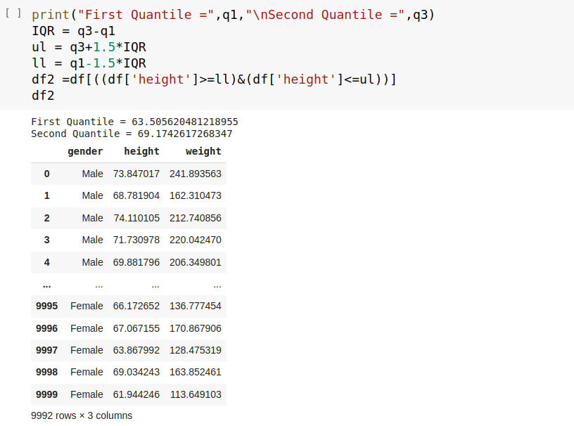


Height - Shape of Dataset after removing Outliers using IQR method:


Height - Without Outliers using IQR method:
height.png


## Result:
Thus the outliers are detected and removed in the given file and the final data set is saved into the file.
